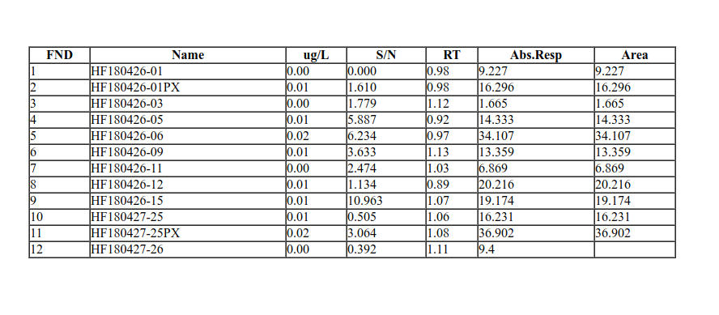

##### 思路 
----
1、观察数据规律 （表头除去id是6个标题 表内容从id 1开始 到下一次出现id是7次）
2、去除不需要的数据
3、取出表头信息
4、取出表内容
5、拿到表头信息和表内容 把它们放到一个新的数组中 表头为k 表内容为 值 

6、循环渲染页面



```php
<?php

//过滤没有用的字符
function classify1($text)
{
    $s = substr($text, 0, strpos($text, 'Response'));
    $str = substr($s, strpos($s, 'Compound name') + 15);

    $th = getNames($str);
    $td = getValues($str);

//    返回表格名称和表格内容
    return [
        $th, $td
    ];
}

//获取表格名称
function getNames($text)
{
//    截取掉除名称之外的数据
    $str = substr($text, 0, strpos($text, 'Area') + 4);
//    转成数组
    $arr = explode(PHP_EOL, $str);

//    因为过滤空值之后生成的数组不是有序的，所以生成一个新的数组，把数据循环添加进去
    $arrs = [];
    foreach ($arr as $k => $row) {
//        过滤空值
        if (!$row) {
            unset($arr[$k]);
        } else {
            $arrs[] = $row;
        }
    }

    return $arrs;
}

//获取表格内容
function getValues($text)
{
//    计算开始位置
    $satrt = strpos($text, 'Area', 5);
//    计算结束位置
    $end = strrpos($text, 'HF', $satrt);

//    截取这中间的内容
    $str = substr($text, $satrt, $end);
    $arr = explode(PHP_EOL, $str);
    unset($arr[0]);
    $arrs = [];
    foreach ($arr as $k => $row) {
        if (!$row) {
            unset($arr[$k]);
        } else {
            $arrs[] = $row;
        }
    }
    return $arrs;
}

$str = file_get_contents('20180601090725_YXSP_169.pdf.text'); // 将文件读取到字符串中

$str_encoding = mb_convert_encoding($str, 'UTF-8', 'UTF-8,GBK,GB2312,BIG5');//转换字符集（编码）

$arr = classify1($str);

$name = $arr[0];  // 返回的表格标题赋值给name
$value = $arr[1];   // 返回的表格内容赋值给value

$arr2 = [];

//遍历表格标题数据
foreach ($name as $nameIndex => $v) {
    $arr2[$v] = $v;
//    定义一个临时的数组
    $temp = [];
//    遍历表格内容数据
    foreach ($value as $valueIndex => $v1) {
//        当值的索引或值除以7的余数等于名称的索引时,就把这个值放到临时的数组中
        if ($valueIndex === $nameIndex || ($valueIndex % 7) === $nameIndex) {
            $temp[] = $v1;
        }
    }
//    最后把临时的数组放进数组中
    $arr2[$v] = $temp;
}

?>

<!doctype html>
<html lang="en">
<head>
    <meta charset="UTF-8">
    <meta name="viewport"
          content="width=device-width, user-scalable=no, initial-scale=1.0, maximum-scale=1.0, minimum-scale=1.0">
    <meta http-equiv="X-UA-Compatible" content="ie=edge">
    <title>Document</title>
    <style>
        table {
            margin: 100px auto;
        }
    </style>
</head>
<body>
    <table border="1"  width="800" border="0" cellspacing="0" cellpadding="0">
        <tr>
            <?php foreach ($arr2 as $k => $v){?>
            <th><?php echo $k ?></th>
            <?php }?>
        </tr>

        <?php foreach ($arr2['Name'] as $k => $v){?>
        <tr>
            <td><?php echo $arr2['FND'][$k]?></td>
            <td><?php echo $arr2['Name'][$k]?></td>
            <td><?php echo $arr2['ug/L'][$k]?></td>
            <td><?php echo $arr2['S/N'][$k]?></td>
            <td><?php echo $arr2['RT'][$k]?></td>
            <td><?php echo $arr2['Abs.Resp'][$k]?></td>
            <td><?php echo $arr2['Area'][$k]?></td>
        </tr>
        <?php }?>
    </table>
</body>
</html>
```